# 하팅!


## 프로젝트 개요

👑 SSAFY 8기 2학기 자율 프로젝트 - **최우수상(1위) 수상** 👑

2023.04.10 ~ 2023.05.19 (39일)

## 목차

1. [프로젝트 기획 배경](#프로젝트-기획-배경)
2. [프로젝트 목표](#프로젝트-목표)
3. [성과](#성과)
4. [서비스명 & 로고](#서비스명--로고)
5. [주요기능](#주요기능)
6. [하팅! 서비스 화면](#하팅-서비스-화면)
7. [기술차별점](#기술차별점)
8. [확장가능성](#확장가능성)
9. [홍보](#홍보)
10. [개발환경](#개발환경)
11. [프로젝트 구조](#프로젝트-구조)
12. [서비스 아키텍쳐](#서비스-아키텍쳐)
13. [협업환경](#협업-환경)
14. [팀원](#팀원)
15. [프로젝트 산출물](#프로젝트-산출물)
16. [프로젝트 발표자료](#프로젝트-발표자료)
17. [회고](#회고)

## 프로젝트 기획 배경

최근에 **사랑한다**고 말해 본 기억이 있으신가요? 꽤 오래 전의 기억이거나, 아예 기억이 없진 않으신가요?

사랑이라는 감정에는 연인간의 **연애 감정** 외에도 가족 간의 **애정**, 친구 간의 **우정**, 동료 간의 **감사함** 등 **다양한 형태**가 있는데요. 모두 소중한 마음임에도 불구하고, 민망하고 부끄럽단 핑계로 표현하지 않고 지나가는 경우가 많습니다. 이 과정에서 멀어지는 관계도 생기죠.

소중한 관계를 이어가기 위해, 소중한 마음을 표현해보는 건 어떨까요?

본격 두근두근 마음 전달 프로젝트! 하팅♡

## 프로젝트 목표

하팅!의 궁극적인 목표는 `성공적인 서비스 운영`으로 잡았습니다. 이를 달성하기 위해 3가지 세부목표를 설정하였습니다.

1. **애자일한 개발**
2. **많은 사용자 받기**
3. **피드백 기반 개선**

성공적인 서비스 운영을 위해서는 우선적으로 6주의 제한된 프로젝트 기간 내 빠른 서비스 개발이 필요했습니다. 따라서 워터폴(Waterfall) 방법론보단 애자일(Agile) 개발 방법론을 채택하였습니다.

현실적인 서비스 운영을 위해서는 실제 유저를 최대한 많이 확보하여 규모있는 트래픽을 경험해야 했습니다. 이를 위해 SSAFY 커뮤니티 Mattermost 메신저 홍보는 물론, 다양한 SNS 홍보활동 및 지인 홍보를 진행하였습니다.

마지막으로 애자일한 개발의 일환으로 실제 사용자의 의견과 피드백을 반영하여 계속적으로 서비스를 개선해 나아가는 목표를 위해, Google Forms를 통한 사용자 설문조사 및 직접 유저들에게 받은 의견 수렴을 통해 서비스 버전을 관리하며 지속 업데이트를 진행하였습니다. 또한, 웹사이트 분석 툴(Google Analytics, Google Tag Manager, Hotjar)을 활용하여 사용자의 행동 패턴, 웹사이트 트래픽, 페이지 이용 시간 등의 유용한 데이터를 수집하고 분석하여 서비스를 개선하였습니다.

## 성과

<p float="left">
  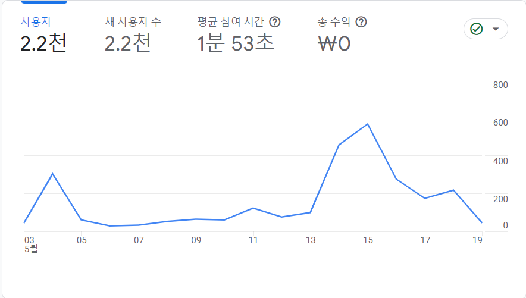
  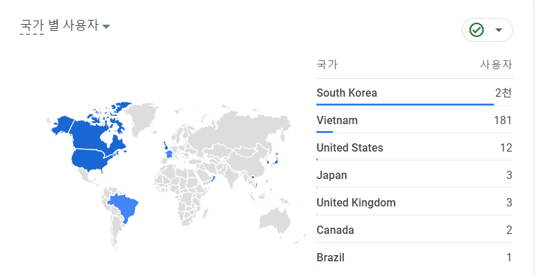
</p>

- 운영 기간: 약 **2주**(23.05.04 ~ 05.18)
- 누적 메시지 수: **3,000**개+
- 총 방문자 수: **2,200**명+ (Google Analytics 기준)
- 총 가입자 수: **530**명+
- 회원 전환율: 약 **25%**
- 발생한 이벤트 수: **45,000**회+
- 평균 상호작용 수: **20.6**회
- 평균 메시지 수: **6**회

[성과 더보기](etc/assets/hearting_more.pdf)

## 서비스명 & 로고


**본격 두근두근 마음전달 프로젝트, 하팅!**

세상에 단 하나뿐인 소중한 마음을 행성으로, 따뜻한 감정을 주고 받아 말랑해진 마음을 녹아내리는 형상으로 표현했습니다. 서비스의 컨셉에 맞게 키치하고 레트로한 감성을 담은 로고입니다.

## 주요기능

**메시지 보내기**

- 하트판은 나만의 공간이자 URL을 통해 접속한 사람만이 볼 수 있는 공간으로 최근 받은 하트를 확인하고 메시지를 작성할 수 있습니다.
- 메시지 작성 시 기본 하트 5개가 주어지고 주고 받은 메시지 개수에 따라 풍부한 감정을 표현하는 스페셜 하트가 주어집니다.

**받은 메시지**

- 받은 메시지는 기본적으로 **24시간** 이후에 사라집니다.
- 내가 받은 메시지에 대해 **반응**을 남길 수 있고 상대방이 확인할 수 있습니다.

**보낸 메시지**

- 내가 보낸 메시지는 기본적으로 **24시간** 이후에 사라집니다.
- 상대방이 내 메시지에 남긴 반응을 확인할 수 있습니다.

**영구 보관함**

- 메시지가 사라지기 전에 저장한 경우 영구 보관함에 보관할 수 있습니다.

**하트 도감**

- 도감에서 내가 사용 가능한 **다양한 하트들과 획득 조건**을 확인할 수 있습니다.

**실시간 알림**

- 메시지 수신 시 및 새로운 스페셜 하트 획득 시 받을 수 있습니다.

**하트테스트**

- 자신의 심볼 하트를 확인할 수 있습니다.

**신고하기**

- 비방·비하·욕설 메시지는 신고할 수 있습니다.

## 하팅! 서비스 화면

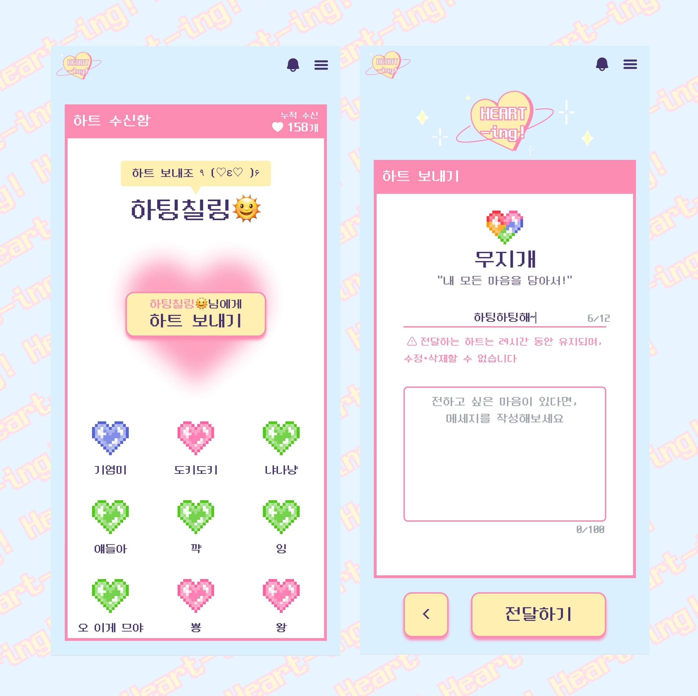

### 홈 화면

- 체험 해보기를 누르거나 스크롤을 내리면 간단히 서비스를 소개합니다.
- 개발팀의 하트 수신함 보러가기를 누르면 개발팀의 `하트 수신함`으로 이동합니다.

**로그인 상태**


- `나의 하트판 가기` 버튼을 누르면 `나의 하트판(하트 수신함)`으로 이동합니다.

**로그아웃 상태**


- 카카오, 트위터, 구글 소셜 로그인을 지원합니다.

### 나의 하트 수신함 (받은 하트)


- 새로운 메시지는 빨간 점으로 표시됩니다.
- 나의 `하트 수신함` 버튼을 눌러 링크, 페이스북, 트위터, 카카오톡으로 공유 가능합니다.
  - 각 플랫폼마다 지정된 템플릿을 적용했습니다.
- 각 `하트`를 클릭하면 해당 메시지를 모달과 함께 확인할 수 있습니다.
  - 남은 시간(타이머), 남긴 반응을 확인할 수 있습니다.
  - 반응, 삭제, 신고할 수 있습니다.

### 하트 수신함

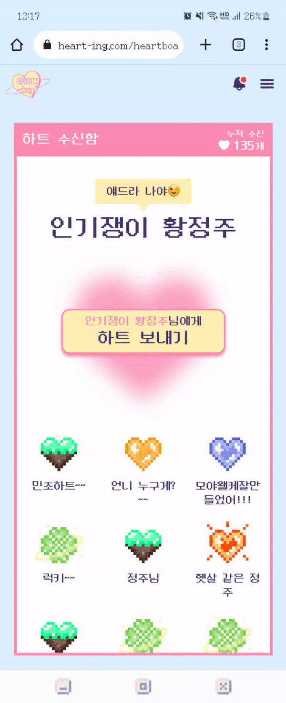

- 다른 사용자의 하트 수신함에서 `하트 보내기` 버튼을 메시지 작성 페이지로 이동합니다.
- 로그인 되어있지 않고, 자신의 수신함 아니면 메시지를 읽을 수 없습니다.
  - 이 경우, `하트`를 클릭하면 부르르 애니메이션으로 상호작용 합니다.

### 메시지 작성


- 획득한 하트 중에서 하나를 선택합니다.
- 제목은 필수로 작성하고, 내용은 선택적으로 작성합니다.
- 모두 작성했으면 전달하기를 누릅니다.

### 보낸 하트


- 각 버튼을 클릭하면 해당 보낸 메시지를 모달과 함께 확인할 수 있습니다.
- 상대방에 남긴 반응을 함께 확인할 수 있습니다.

### 영구 보관함

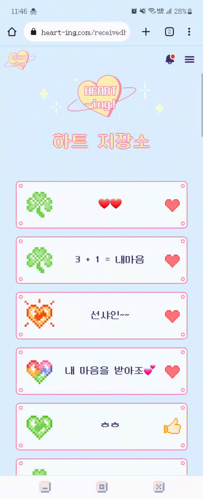

- `하트`가 사라지기 전에 저장한 경우 영구 보관함에 보관할 수 있습니다.
- 각 버튼을 클릭하면 해당 메시지를 모달과 함께 확인할 수 있습니다.
  - 받은 날짜, 남긴 반응을 확인할 수 있습니다.
  - 반응, 삭제, 신고할 수 있습니다.

### 하트 도감

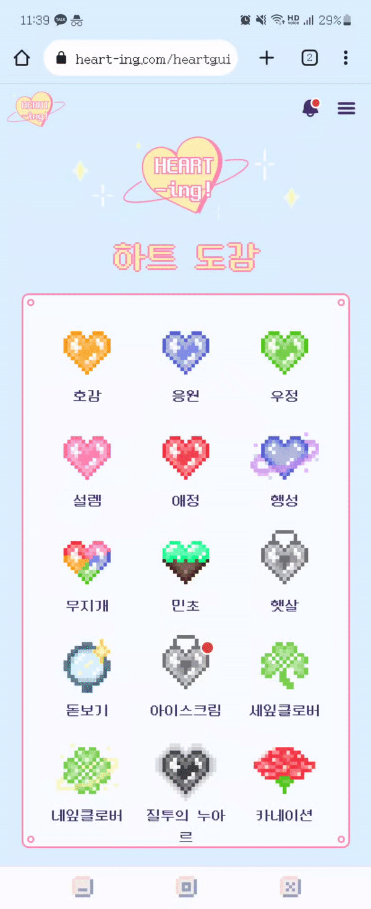

- 메시지 작성이 가능한 다양한 `하트`들을 확인할 수 있습니다.
- 획득하지 못한 `하트`는 자물쇠로 잠겨있습니다.
- 획득 조건을 달성하면 빨간 점으로 표시됩니다.
- 각 `하트`를 클릭하면 모달과 함께 스토리, 획득 조건을 확인할 수 있습니다.

### 실시간 알림

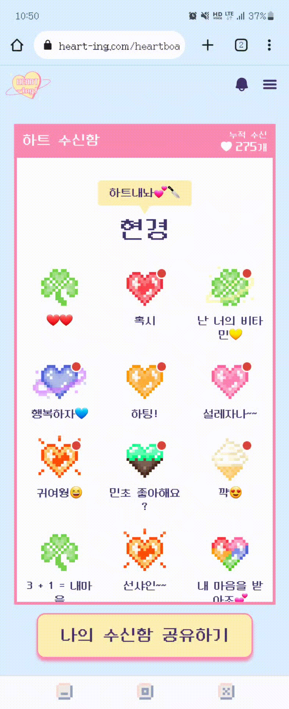

- 메시지, 반응 수신 및 새로운 스페셜 하트 획득 시 실시간으로 받을 수 있습니다.
- 읽은 알림과 안읽은 알림은 구분됩니다.
- 받은 시점으로부터 시간 경과를 알 수 있습니다.
- 안읽은 알림이 있으면 빨간 점으로 표시됩니다.

### 사용설명서

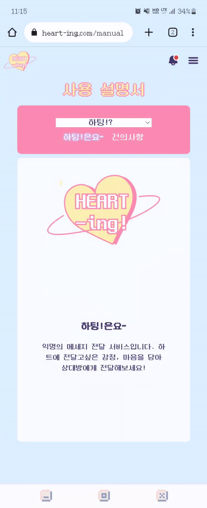

- 하팅의 기능을 간단한 설명과 사진으로 설명합니다.

### 하트테스트

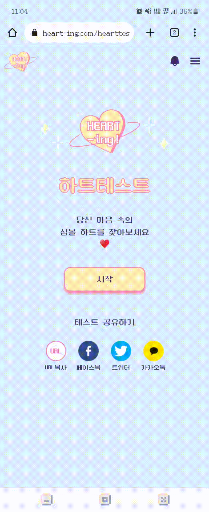

- 자신의 심볼 하트를 확인할 수 있습니다.
- 링크, 페이스북, 트위터, 카카오톡으로 결과 페이지를 공유할 수 있습니다.
  - 각 플랫폼마다 지정된 템플릿을 적용했습니다.

### 신고하기


- 메시지 우측 상단에 위치한 `신고하기` 버튼을 눌러 진행합니다.
- 메시지별로 한 번만 신고할 수 있고, 누적 신고 당한 횟수가 3회인 유저는 3일간 계정 일시 정지가 됩니다.
- 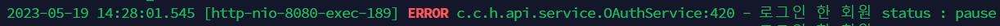
- 누적 신고 당한 횟수가 5회에 도달하면 해당 유저는 계정 영구 정지 처리가 됩니다.

## 기술차별점

### 유저 경험 향상

**WebSocket 전용 서버 사용**

- 하트를 받은 유저의 메인 페이지에 실시간 알람을 구현함으로써 유저경험을 향상시켰습니다.
- 웹소켓 실시간 통신의 원활한 구동을 위해 node.js로 별도의 웹소켓 백엔드 서버를 구현했습니다.
- 특히 향후 사용자 피드백을 통한 추가 실시간 기능 추가 필요 시 메인 백엔드 서버의 부하를 덜 수 있습니다.
- Kubernetes Deployment로 다수 node.js 서버를 운영하기 위해 redis cluster를 통해 각 node.js 서버 상태공유를 구현하였습니다.

### 대규모 트래픽 대응

**Kubernetes Cluster 사용**

- 대규모 트래픽 발생에 대비하여 백엔드 서버(Spring Boot, node.js)를 Kubernetes Deployment로 관리하여 다수의 백엔드 서버를 구동하고 요청에 대한 Load Balancing을 구현하였습니다. 이로써 각각의 서버에 대한 부담을 줄여 백엔드 안정성을 향상시킵니다.
- Kubernetes를 활용함으로써 관리하는 서버의 항상성을 보장합니다. 몇 개의 서버가 다운되어도, 다른 서버가 살아있기 때문에 전체 서비스가 다운될 가능성을 줄이고, 다운된 서버를 쿠버네티스가 다시 구동시켜 안정적인 시스템 구축을 지원합니다.
- Kubernetes를 활용하여 Rolling Update를 구현했습니다. Agile하게 개발하여 배포 횟수가 잦은 만큼 서비스에 지장 없이 신규 버전을 배포하는 것이 중요하다고 생각하였습니다.
- 또한, 다수의 node.js 서버를 두어도 웹소켓 통신이 원활하게 하기 위해 Redis Cluster로 node.js 서버들의 상태관리를 할 계획입니다. 이 Redis Cluster는 Kubernetes StatefulSet로 관리합니다.

**Redis 캐싱 및 Replication**

- Redis는 인메모리 구조 데이터베이스로, redis 캐싱을 이용하면 MySQL 보다 빠르게 데이터에 접근할 수 있습니다.
- Redis Hash 자료구조를 사용하여 기존의 하트 획득 로직 성능을 O(M\*N) 에서 O(1)로 최적화하였습니다.
- Read가 많은 데이터를 레디스에 저장하여 API 응답 속도를 최적화했습니다.
- 장애를 대비하여 replication을 구축해 사용성을 높였습니다.

### 반응형 웹

**독자적 환산단위 적용한 반응형 웹 구현**

- 모바일 환경에서 url바와 하단의 네비게이션 바로 윗부분 혹은 아랫부분이 잘리는 현상이 발생했습니다.
- 이를 해결하기 위해, 자바스크립트의 가장 상단에서 innerHeight의 1%의 값을 구해 --vh라는 속성으로 새로 정의하는 함수를 만들어 호출했습니다. 이를 기준으로 레이아웃을 배치해 호환성을 높였습니다.

**기기 상관 없는 안정적인 뷰 제공**

- 데스크탑 환경에서 핸드폰 화면처럼 좁게 보이게 적용하거나, 사이드바는 환경마다 열리는 위치가 달라지게 적용하는 등 다양한 이벤트에서 최적화된 화면을 제공하려 노력했습니다.

### 데이터 기반 의사결정

**웹사이트 분석 툴**

- Google Analytics
  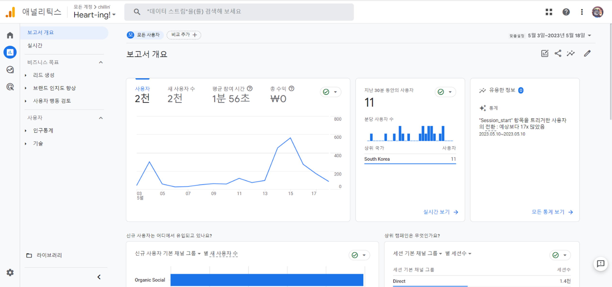

  - 보고서
    - 사용자 수, 새 사용자 수, 유입 수단, 국가/지역, 이벤트 수, 전환율 등을 확인했습니다.
  - 실시간
    - 실시간으로 사용자 수, 지역, 유입 수단 등을 파악하여 주로 배포 직후에 반응을 확인했습니다.
  - 탐색
    - 보고서에서 볼 수 없는 내용을 새로운 정의 보고서를 만들어 파악했습니다. 주로 사용자의 재사용 여부, 이탈율, 전환율 등을 확인했습니다.

- Google Tag Manager
  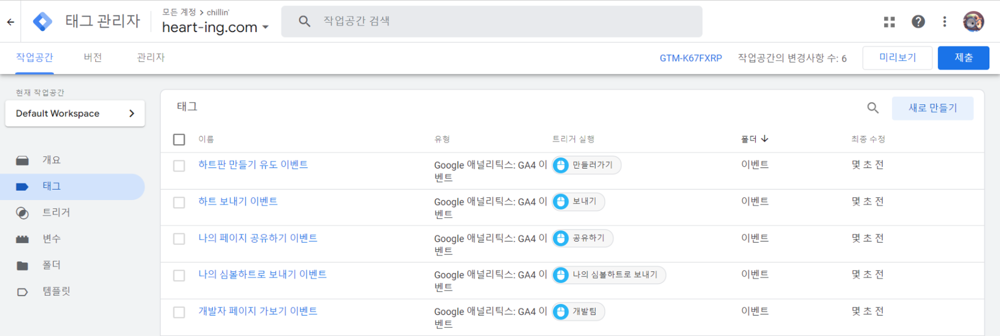

  Google Analytics에서 기본으로 제공하는 데이터 외의 커스텀된 상세한 이벤트 전환율을 확인하기 위해 사용했습니다. 주로 하트 수신함 만들기, 하트 보내기, 나의 페이지 공유하기 등 주요 기능을 기준으로 태그를 만들었으며 클릭 등의 트리거를 기준으로 전환수를 저장 및 관리했습니다.

- Hotjar

  - Recording <br/>
    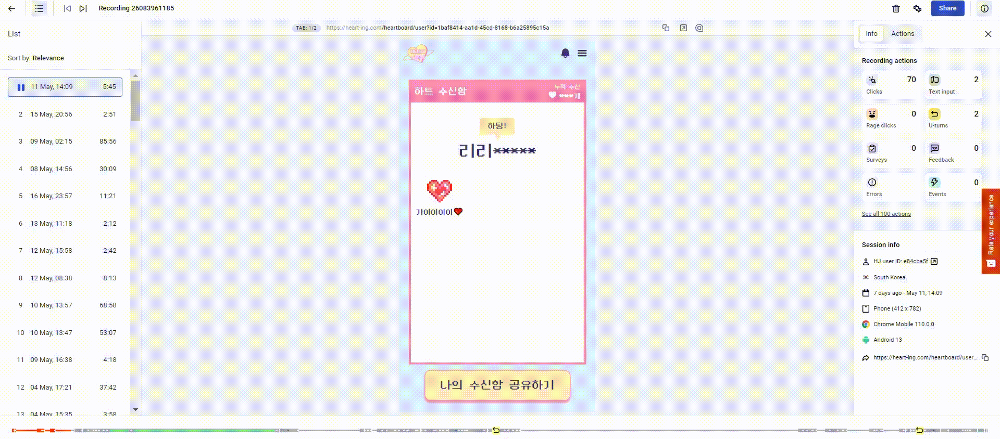 <br/>
    익명성을 보장하며 상세 내용은 \*표 처리되어 녹화된 형태로 사용자 흐름을 파악할 수 있습니다. 사용자의 행동 (스크롤, 클릭, 페이지 이동 등)을 기준으로 해당 녹화 내용이 얼마나 높은 영향을 가지고 있는 흐름이었는지 확인할 수 있습니다. 이를 기반으로 의도했던대로 흐름이 진행되는지 확인하였습니다.
  - Heatmap <br/>
    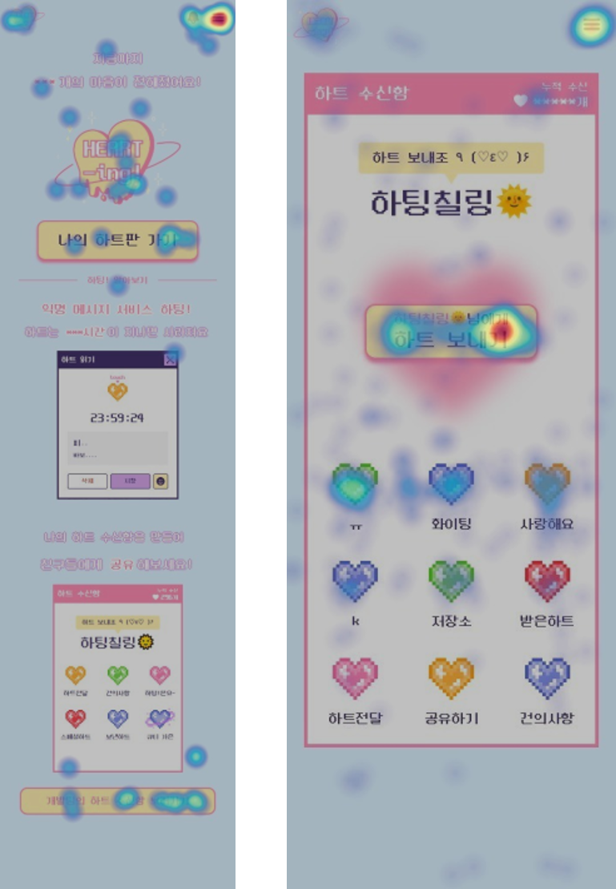 <br/>
    사용자가 얼마나 잦은 빈도로 클릭했는지, 이 페이지에 방문한 사용자 중 몇 퍼센트가 클릭했는지 확인할 수 있습니다. 해당 내용을 바탕으로 의도 했던 것과 다르게 클릭이 진행되 부분이 있는지 체크하였습니다.

GA4, Hotjar에서 기본으로 제공하는 데이터로 사용자 흐름을 분석하기에 어려움이 있었습니다. 또한 저희 서비스가 한페이지에서 다양한 이벤트가 일어나는 특성상 정확한 이벤트 별 지표가 필요하다고 판단했습니다.

Google Tag Manager를 사용해 트리거-변수를 묶은 태그 단위로 필요한 이벤트 전환율을 측정할 수 있었습니다.

### 아토믹 디자인

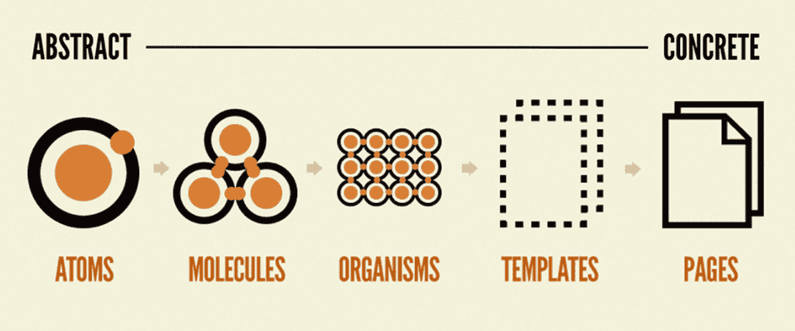

- 아토믹 디자인 도입하여 일관성과 확장성을 가진 컴포넌트를 구축합니다.
- Page단에서만의 API 통신으로 컴포넌트 간 의존성 낮춥니다.

### 확장가능성

**다양한 언어 지원**

- 약 2주간의 운영 기간 동안 Google Analytics를 분석해 본 결과 다음 그림과 같이 해외 각국에서 하팅에 접속한 기록을 확인할 수 있었습니다. <br/>
  

- 아래 그림에서 보이는 것과 같이 번역을 시도한 기록도 확인할 수 있었습니다. <br/>
  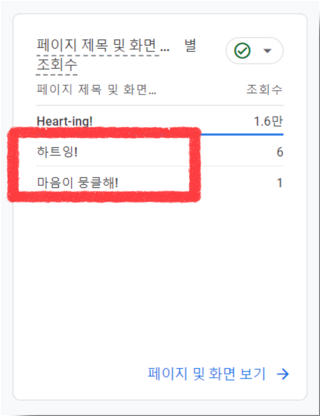

- 유저풀 확장
  - 이러한 결과를 바탕으로 글로벌 시장에 대한 가능성을 확인해 보기 위해, 영어 페이지를 구축하여 글로벌 유저에게 서비스를 제공해 보고자 합니다.
  - 또한 번역 라이브러리를 통해, 제3의 언어를 제공할 수 있는 방안을 마련할 예정입니다.

**어플리케이션 출시**

- 유저 대상 설문조사 결과

  - 푸시 알람 기능과 같이, 접근성이 높은 기능을 원하는 유저들이 있었습니다.
    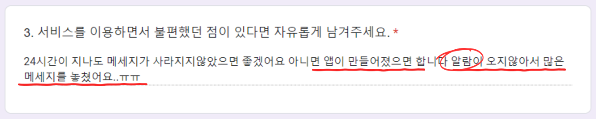

  - 즐겨찾기, 댓글 등 꾸준히 소통이 오갈 수 있는 기능을 마련해 달라는 의견이 꾸준히 들어왔습니다.
    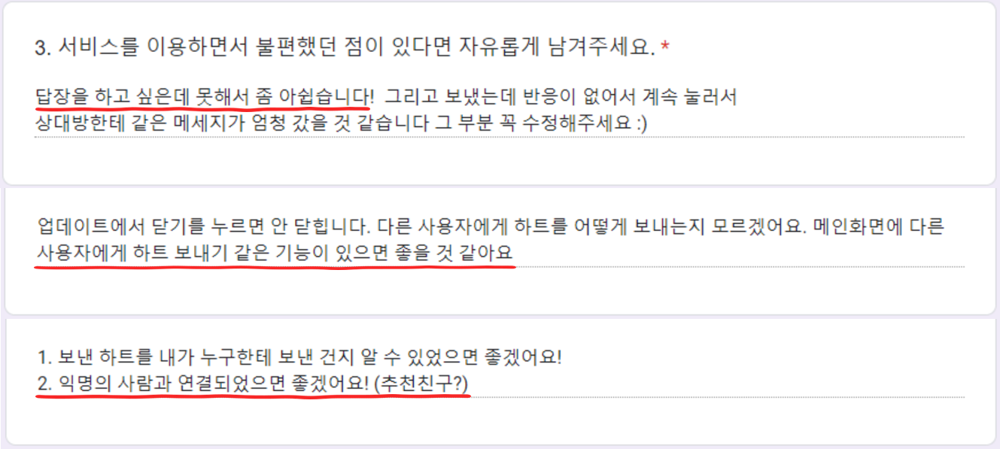

  - 이를 종합해 봤을 때, 하팅을 적극적으로 이용하는 유저들은 장기적으로 소통할 의사가 있으며, 보다 높은 접근성을 원한다는 것을 알 수 있었습니다.

- 장기 유저 유도
  - 접근성을 높이고, 장기적으로 사용하기 편한 환경을 조성하기 위해, 하팅을 애플리케이션으로 전환하고자 합니다. 이를 통해 적극적인 유저들을 장기 유저로 자리할 수 있도록 유도하고자 합니다.

## 홍보

### 공식 SNS 계정 운영

인스타그램, 트위터, Mattermost 등 SNS에서 공식 계정을 운영하며 서비스를 홍보하는 동시에 유저와의 소통 창구를 마련
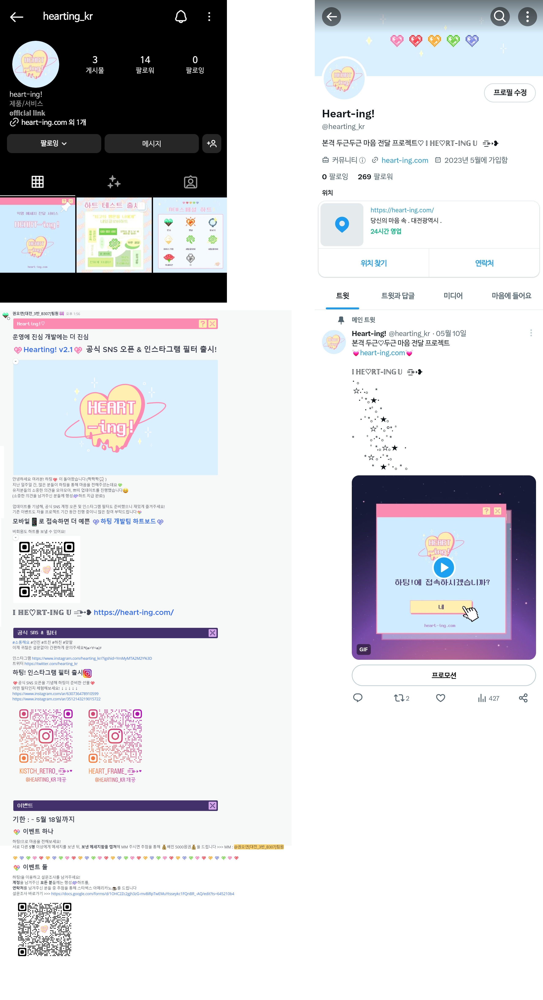

### Meta Spark 효과 (Spark AR)

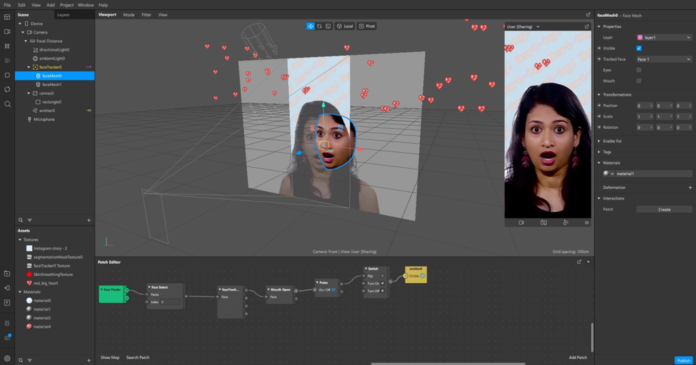

하팅의 홍보를 위해 MZ세대를 겨냥하는 인스타그램/페이스북 효과(필터)를 제작했습니다. Meta의 증강현실 AR효과 개발 도구 Spark AR을 활용했습니다. 얼굴을 인식해 트래킹하고, 얼굴에 피부 보정 효과를 넣었습니다. 입을 여닫으면 하팅의 애정하트 파티클이 on/off 됩니다.

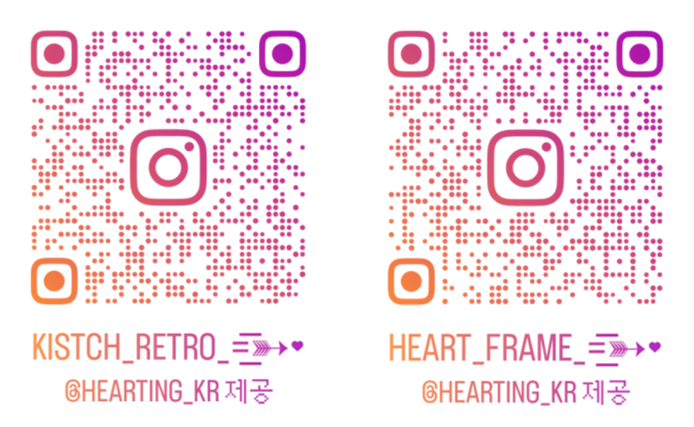

### 하트테스트 (하트 성격 유형 검사)

유행하는 MBTI 성격 유형 검사를 응용해, 하트 유형 검사 페이지를 제작했습니다.
하트에 대한 흥미를 높이고, 결과 공유를 통해 전파될 수 있도록 구성했습니다.
정적 페이지로서, 서버와의 통신 없이 JSON 데이터로 관리하여 구현했습니다.

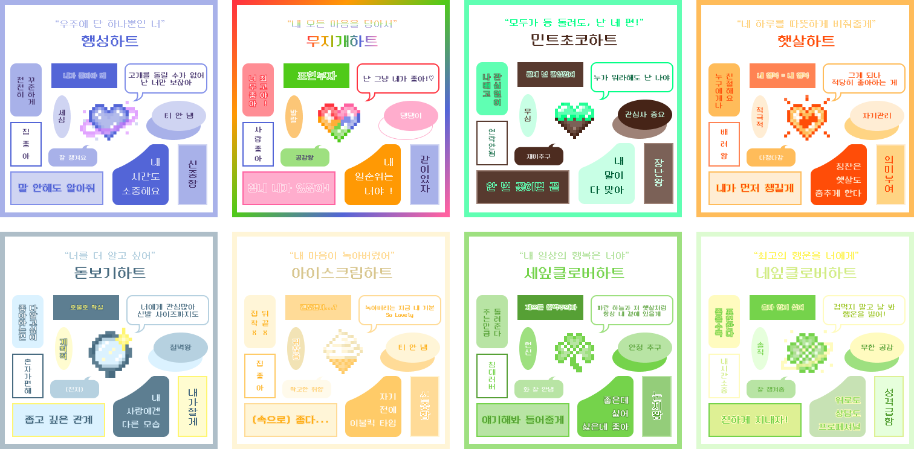

## 개발환경

### Frontend

- Node JS 18.13.0 (LTS)
- React 18.2.0
  - Recoil 0.7.7
- Typescript 4.9.5
- Axios 1.3.6
- Tailwind CSS 3.3.1

### Backend

- Java
  - Java OpenJDK 11
  - Spring Boot 2.7.10
    - Spring Data JPA 2.7.10
    - Spring Security 2.7.10
    - JUnit 5.8.2
    - Lombok 1.18.26
  - Gradle 7.6
- Node JS 18.13.0 (LTS)
- Socket IO 4.6.1

### Server

- Ubuntu 20.04 LTS
- Nginx 1.18.0
- Docker 23.0.4
- Docker Compose 2.17.2
- MicroK8s (Kubernetes) 1.26.4
- Sonarqube 3.4.0
- Jenkins 2.387.3

### Database

- MySQL 8.0.30
- Redis 7.0.11

### UI / UX

- Figma 93.4.0

### IDE

- Visual Studio Code 1.78.2
- IntelliJ IDEA 2023.1

### 형상 / 이슈관리

- Gitlab
- Jira

### 웹사이트 분석/관리

- Google Analytics 4
- Google Tag Manager
- Hotjar

### 기타 툴

- Postman 10.14.2
- Termius 7.58.7

## 프로젝트 구조

### Frontend (React)

```
Hearting
├── assets
│   └── images
│       ├── logo
│       ├── pixel
│       │   ├── button
│       │   ├── emoji
│       │   └── heart
│       ├── png
│       ├── sharing
│       └── social
├── atoms
├── components
│   ├── Home
│   ├── common
│   ├── heartBoard
│   ├── heartBox
│   ├── heartGuide
│   ├── heartResponse
│   ├── heartTest
│   ├── heartwrting
│   ├── manual
│   ├── modal
│   ├── navbar
│   ├── popUp
│   └── reporting
├── features
│   ├── api
│   └── hook
├── pages
├── styles
└── types
```

### Backend (Spring Boot)

```
Hearting
├── api
│   ├── controller
│   ├── data
│   ├── request
│   ├── response
│   └── service
├── config
├── db
│   ├── domain
│   └── repository
├── exception
├── jwt
├── oauth
│   ├── domain
│   └── info
└── util
```

### Backend (NodeJS)

```
Hearting
├── Dockerfile
├── app.js
├── config.env
├── package-lock.json
├── package.json
├── public
│   ├── index.html
│   └── script.js
└── server.js
```

## 와이어프레임


## ERD

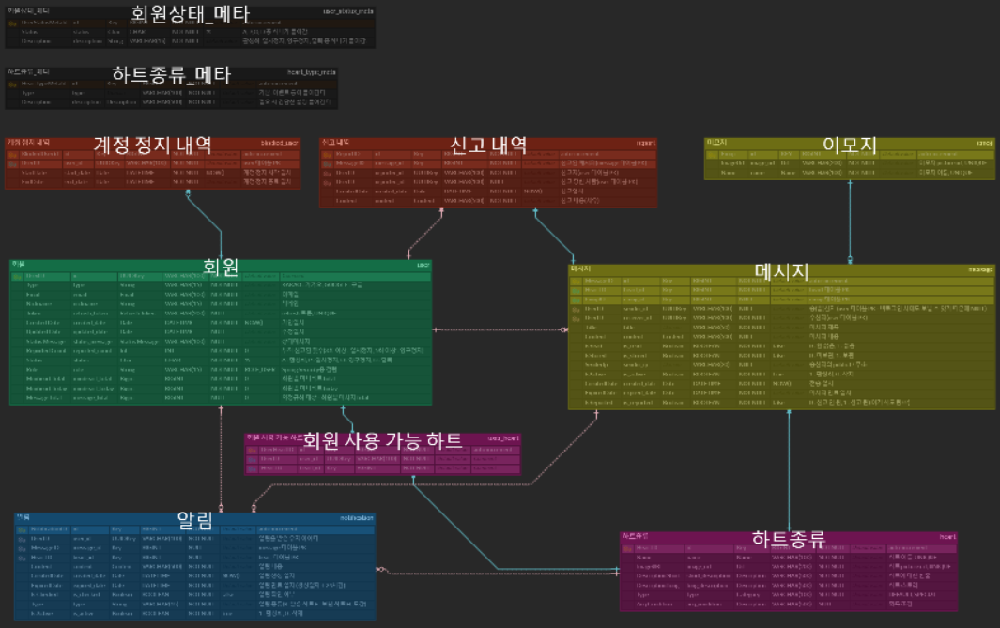

## 서비스 아키텍쳐


## 협업 환경

### Git으로 협업하기

Git을 통한 협업 방식은 [우아한 형제들 Git Flow](https://techblog.woowahan.com/2553/)를 기본 베이스로 삼았습니다.

브랜치는 master, develop, feature 총 3가지를 사용했으며 전략은 다음과 같습니다.

- `master`: 서비스가 출시될 수 있는 브랜치입니다. master 브랜치에 올라온 기능들은 에러 없이 작동하는 상태입니다.

- `develop`: 다음 서비스 출시를 위해 실제 개발이 이루어지는 브랜치입니다.

- `feature`: 기능 단위 개발을 위한 브랜치로 develop에서 분기하여 개발이 끝나면 각각 베이스 브랜치로 병합됩니다.

매주 한 번 이상 모든 feature 브랜치를 develop 브랜치로 병합 후 배포하여 실제 배포 환경에서 잘 동작하는지 여부를 확인했습니다.

### Jira로 협업하기

매주 월요일 스프린트 회의를 통해 그 주의 목표를 세우고 목표 달성을 위한 구체적인 작업들을 정리했습니다.

유튜브 라이브와 같이 공통적인 일정부터 팀 회의, 파트별 회의, 개인 개발 작업까지 회의를 통해 구체적으로 계획했습니다.

이를 위해 사용된 요소들은 다음과 같습니다.

`에픽`: 어떤 작업이 속하는 최상위 레벨로 학습, 설계, 회의, 개발, 공통 총 5가지 에픽을 만들었습니다.

`스토리`: 에픽에 속하는 작업의 단위입니다. 구체적인 작업 내용을 작성하고 스토리 포인트로 예상 소요 시간을 산정할 수 있습니다. 한 스토리 당 최대 4시간을 넘지 않게 하였고 개인별로 매주 40시간 이상 할당했습니다.

`번다운 차트`: 스프린트의 목표를 달성하기 위해 남은 시간과 남은 스토리 포인트를 확인해 프로젝트의 진척도를 파악할 수 있는 지표입니다.

### Notion으로 협업하기

회의록, 스크럼 회의, 발표 정리, 문서 정리, 기획서 등 자료들을 Notion을 통해 작성 및 관리하였습니다.

- `회의록`: 매일 회의한 내용을 회의록으로 기록하였습니다.
- `프로젝트 일지`: 개인별로 프로젝트 일지(problem-cause-solution)를 작성하였습니다. 프로젝트 일지는 개발하면서 만난 오류와 문제 상황을 정리하고 원인과 해결방법을 적습니다.
- `컨벤션`: 프로젝트의 모든 컨벤션들을 문서화하여 모두가 공유 가능하도록 하였습니다. 기록 및 정리한 컨벤션들에는 Git 컨벤션, Jira 컨벤션, FE 컨벤션, BE 컨벤션이 있습니다.
- `프로젝트 문서 관리`: 요구사항 정의서, 기능명세서, 일정관리 등 공유 문서 관리를 노션에 기록하여 모두가 동일한 목표를 가지고 개발 할 수 있도록 하였습니다.

## 팀원

### **Chillin'** 팀 소개

|                                                                    [권오연](https://github.com/KooooY)                                                                    |                        [손민혁(팀장)](https://github.com/sonmh79)                         |                           [서현경](https://github.com/nanalyee)                           |                           [이가은](https://github.com/haegomm)                            |                        [임영묵](https://github.com/Youngmook-Lim)                         |                            [황정주](https://github.com/wjdwn03)                            |
| :-----------------------------------------------------------------------------------------------------------------------------------------------------------------------: | :---------------------------------------------------------------------------------------: | :---------------------------------------------------------------------------------------: | :---------------------------------------------------------------------------------------: | :---------------------------------------------------------------------------------------: | :----------------------------------------------------------------------------------------: |
|  |  |  |  |  |  |
|                                                                               **Frontend**                                                                                |                                        **Backend**                                        |                                        **FE / GE**                                        |                                       **Frontend**                                        |                                      **BE / Infra**                                       |                                        **Backend**                                         |

### 팀원 역할

**FrontEnd**

- 권오연
  - 서비스 기획
  - 서비스 컨셉 및 로고 디자인
  - UI/UX
  - 컴포넌트 구조 설계
  - 웹소켓 클라이언트(알람) 구현
  - 소셜로그인(카카오, 구글, 트위터)
  - 메세지 작성 및 삭제, 하트 수신함 내 프로필박스, 프로필 수정, 사이드바, 알람 구현
  - 하트 성격테스트 기획, 디자인, 구현
- 서현경
  - 하트 수신함 (받은 하트), 메시지 상세 모달(내용, 타이머), 영구보관함, 보낸하트, 홈페이지 개발
  - 반응형 레이아웃, 애니메이션, Tailwind CSS 테마, 플러그인 개발 및 관리
  - 웹사이트 분석 및 관리 (GA4, GTM, Hotjar)
  - UI/UX, 하트 디자인(aseprite)
- 이가은
  - 하트 도감, 반응하기, 신고하기, 팝업(업데이트, 로그인 유도), 사용 설명서 구현
  - Tailwind CSS
  - UX/UI
  - 산출물 관리

**BackEnd**

- 손민혁
  - 팀장
  - Spring Boot 서버 REST API 개발(영구 보관함/보낸 메시지/하트 도감 - 저장/조회/삭제 등)
  - 스페셜하트 획득 로직 설계
  - Redis 설계(캐싱 및 레플리케이션)
  - Jenkins-Sonarqube 정적 코드 검사 파이프라인 구축
- 임영묵
  - Spring Boot 서버 REST API 개발 (받은메시지 및 메시지 공통기능 API 개발)
  - TDD(Test Driven Development) 기반 테스트 코드 작성
  - Node.js 웹소켓 서버 개발
- 황정주
  - Spring Boot 서버 REST API 개발 (소셜 로그인, 프로필 수정, JWT 재발급, 하트판 주인 정보 조회 API 개발)
  - Spring Security 담당
  - OAuth2, OAuth1을 이용한 소셜 로그인(카카오, 구글, 트위터) 개발
  - JWT 발급 개발 및 관리
  - S3 버킷 관리

**Infra**

- 임영묵
  - 전체 아키텍쳐 설계
  - Jenkins CI/CD Pipeline를 통한 빌드/배포 자동화 시스템 구축
  - Kubernetes 클러스터 구축
  - Node.js 서버 인스턴스 간 상태 공유를 위한 Redis 클러스터 구축
  - AWS EC2 환경설정 (Nginx, Docker, MySQL, 방화벽 설정 등)
  - DockerHub를 활용한 서버 이미지 버전 관리

## 프로젝트 산출물

- [기능명세서](docs/hearting_%EA%B8%B0%EB%8A%A5%EB%AA%85%EC%84%B8%EC%84%9C.pdf)
- [2차 배포 반영사항](docs/hearting_2%EC%B0%A8%EB%B0%B0%ED%8F%AC%EB%B0%98%EC%98%81%EC%82%AC%ED%95%AD.pdf)
- [3차 배포 반영사항](docs/hearting_3%EC%B0%A8%EB%B0%B0%ED%8F%AC%EB%B0%98%EC%98%81%EC%82%AC%ED%95%AD.pdf)
- [와이어프레임](docs/hearting_wireframe.png)
- [ERD](docs/hearting_erd.png)
- [아키텍쳐](docs/hearting_architecture.png)
- [API 문서](docs/hearting_api_docs.pdf)
- [Git Convention](docs/hearting_git_convention.pdf)
- [포팅매뉴얼](exec/hearting_%ED%8F%AC%ED%8C%85%EB%A7%A4%EB%89%B4%EC%96%BC.pdf)

## 프로젝트 발표자료

- [중간발표 Presentation](docs/hearting_%EC%A4%91%EA%B0%84%EB%B0%9C%ED%91%9C%EC%9E%90%EB%A3%8C.pdf)
- [최종발표 Presentation](docs/hearting_%EC%B5%9C%EC%A2%85%EB%B0%9C%ED%91%9C%EC%9E%90%EB%A3%8C.pdf)

## 회고

### 손민혁

언제나 그랬듯 치열한 6주였습니다.

매주 새로운 목표를 세우고, 목표 달성을 위해 달리고, 유저의 반응을 기다리기를 반복하며 애자일한 프로세스를 경험해볼 수 있었습니다. 덕분에 한 주 한 주가 보람찼습니다.

2주만에 사용자 2000명+, 회원 500명+ 등 초기 세웠던 목표를 뛰어넘는 성과를 기록했습니다. 눈부신 햇살에 손으로 눈을 가리며 가볍게 이야기했던 목표를 완벽하게 달성하고 많은 것을 얻어갈 수 있어 좋았습니다. 서로가 잘하는 것에 집중하고 맡은 역할에 최선을 다했기 때문이라고 생각합니다. 또한, 서로를 배려하고 존중하며 계속 소통했던 것도 빼놓을 수 없겠네요. 종합적으로 시너지 효과가 많이 난 프로젝트였습니다!

개인적으로 하트 획득 로직 설계에 많은 고민을 하였고 코드에 애정이 생겼습니다. 로직을 설계하고 비효율적인 코드를 개선하기 위해 갈아엎고 다시 짜고를 반복하며 점점 개선되어가는 코드를 보며 뿌듯했습니다. 아직도 부족한 점이 있어 보다 객체지향적인 방식으로 리팩토링을 진행하려 합니다.

레디스를 실제 하트 획득 로직에서 적용해볼 수 있어서 좋았습니다. 복잡한 연산 결과를 보다 효율적으로 저장/관리하고 캐싱으로 최적화까지 시도해볼 수 있는 좋은 경험을 하였습니다. 많은 고민과 짧지 않은 개발의 시간동안 믿어주고 함께 고민해 준 팀원들에게 감사합니다!

싸피 2학기 첫번째 프로젝트에서 만났던 사람들과 인연이 닿아 마지막 프로젝트까지 1위로 장식하며 마무리할 수 있어서 영광입니다. 서로 다른 강점을 가진 6명이 만나 혼자라면 절대 불가능했을 많은 경험을 할 수 있었습니다. 모두에게 정말 감사하고 다들 고생많으셨습니다!

### 권오연

개발자로 전향하며 제가 추구했던 가치는 늘 같았습니다. ‘유저의 숨겨진 니즈를 파악하고 먼저 제공하는 서비스를 만들자!’. 지난 세 번의 프로젝트를 진행하며, 팀원들과 끊임없이 논의하고 아이디어를 디벨롭하면서 가치관을 구체화해보았습니다. 특히나 ‘하팅’은 직접 유저의 소리를 듣고, 유저의 행동을 분석하며 치열하게 검증하는 시간이었습니다. ‘하팅!’의 좋은 성적으로 우리가 추구한 가치가 옳았음이 증명된 것 같아 매우 기쁩니다.

지난 프로젝트 경험을 바탕으로, 효율적인 컴포넌트 구조화에 가장 신경 쓴 프로젝트입니다. 피그마로 화면 디자인을 하면서 공통으로 사용 가능한 것들을 따로 묶고, 데이터의 흐름을 고려하며 불필요한 이동이나 렌더링이 없도록 생각하며 구조를 세워본 경험은 리액트의 라이프사이클에 대한 이해를 높여주었습니다. 뿐만 아니라 초기에 세워둔 구조 덕에 프로젝트가 진행될수록 효율적으로 업무를 분담할 수 있어 편리했습니다.

웹소켓과 OAuth1(트위터 로그인)을 처음으로 다뤄본 프로젝트기도 했습니다. 새로운 기술을 도입할 때마다 느끼는 것은, ‘기본에 충실하자’입니다. 이전에는 급한 맘에 유사하게 구현해 본 사람의 블로그 후기 글을 읽고 구현했는데, 우리 서비스에 핏한 기능이 아니기 때문에 오히려 다시 커스텀하느라 오랜 시간이 걸리곤 했습니다. 그런 경험에서 우선 공식 문서부터 읽어보면 공식 문서를 읽으며 플로우 파악이 선행되어야 프로젝트에 맞게 커스텀하기 쉽다는 걸 깨달았고, 이번에는 Socket.io와 트위터 Developer Platform의 공식문서부터 꼼꼼하게 읽으며 구현했습니다. 덕분에 우리 서비스에 맞는 효율적이고 컴팩트한 코드로 리팩토링 할 수 있었고, 더불어 기술 자체에 대해서도 깊은 이해를 갖출 수 있었습니다.

한 가지 아쉬운 것이 있다면, 일정 상 초기에 계획한 SSR로 구현하지 못 한 것입니다. 서버를 유지하며 계속 운영하기로 한 만큼, SSR로 다시 구현해보며 좀 더 효율적인 구조로 리팩토링 해 볼 생각입니다.

‘하팅!’을 구현하는 동안 얻은 보람, 깨달음, 그리고 디벨롭 계획까지, 모두 미래에도 함께 하고 싶은 좋은 팀원들을 만났기에 가능한 일입니다. 서로 다른 배경과 포지션의 팀원들과 효과적으로 소통하고, 의견을 조율하는 법을 배운 것이 SSAFY 교육을 들으면서 얻은 가장 큰 소득입니다. 기술적으로도 인성적으로도 많은 가르침을 준 팀원들께 감사드리며, 다른 분들께도 제가 좋은 팀원이었길 바랍니다. 고생하셨습니다!

### 서현경

"저는 많은 사람들과 따스운 마음을 주고받을 수 있는 롤링페이퍼 서비스를 제작하고 싶습니다."

1년 전, SSAFY 면접에서 어떤 프로젝트를 가장 만들고 싶은지에 대한 저의 답변이었습니다. 그리고 1년이 지난 지금, 하팅을 통해 약 3000개의 마음이 오고 게 되었습니다. 저의 SSAFY 목표를 이룰 수 있어서, 가장 시너지가 잘 맞았던 팀원들과 좋은 결과로 마무리하게 되어서 마음이 정말 벅찹니다.

하팅을 제작하며 가장 노력했던 것은 '사용자에게 즐거운 경험을 제공하는 것'이었습니다. 따라서 탄탄한 설계, 애자일 개발, 사용자 테스트, 구글 폼을 이용한 피드백 수집, 웹사이트 분석 툴 이용, 홍보까지 다양한 과정을 거쳤습니다. 특히 유저 피드백을 반영하기 위해 회의가 잦았는데 회의 시간이 길어져도 팀원분들이 아무도 지친 기색을 보이지 않고 모두 몰입했던 것이 기억에 남습니다. 이러한 노력 덕분에 많은 사용자를 받고 운영이 가능했다고 생각합니다.

FE에서 1차 배포 이후로는 사용자 피드백에 맞춘 수정에 포커스를 맞추어 개발이 진행되었습니다. 효율적인 컴포넌트 관리에 신경을 쓴 만큼 코드 로직 변경이 수월했고 맡은 부분이 바뀌어도 쉽게 수정 및 추가할 수 있었습니다. 특히 이 부분은 웹사이트 분석 툴을 이용할 때에도 빛을 발했습니다. 잘 모듈화된 컴포넌트 덕분에 Google Tag Manager에서 태그를 지정하는 단위가 뚜렷해져서 이벤트를 지정하기 용이했기 때문입니다. 중요성을 몸소 깨닫게 된 만큼 이후에 관련된 부분을 좀 더 깊게 공부하고 싶습니다.

칠링 팀 분들 덕분에 개발 역량을 포함한 많은 것을 배우고 성장할 수 있었습니다. 1년 SSAFY 과정을 함께 마무리할 수 있어서, 좋은 추억을 많이 남겨주셔서 마무리하려니 이제 뭉클합니다. 고생 많으셨습니다. 앞으로도 이 배움 잊지 않고 정진하겠습니다.

### 이가은

마지막 프로젝트가 수상과 더불어 누적 사용자 2천 2백명이라는 큰 성과를 얻으며 마무리가 되어 매우 뜻깊습니다.

이번에는 6주동안 팀 내의 소통 뿐 아니라 유저와의 소통과 함께 프로젝트를 진행했습니다. 화면 구성단계부터 3번의 배포를 거치며 유저들의 피드백과 데이터로 회의하고, 우선순위를 정하고 기능을 개발을 하며 애자일한 개발을 경험했습니다. 이러한 경험을 얻을 수 있었던 것은 함께 했던 우리 팀원들 덕분인 것 같습니다. 촉박하고 지칠 수 있었던 기간이었지만 모두가 밤낮 없이 맡은 역할을 잘 마무리하고자 최선을 다했고 그랬기에 애자일한 개발과 사용자 받아보기라는 팀의 목표를 넘어선 결과를 얻을 수 있었습니다.

유저의 사용경험이 중요했기에 유저에게 버튼 위치, 워딩, 화면 구성 등을 물어가며 와이어프레임을 설계한 경험은 사용자의 시각을 한 층 더 깊이 이해할 수 있게 하였습니다. 또한 렌더링의 최소화를 위해 컴포넌트를 모듈화 하였고, 효율성과 재사용성을 위해 공통 로직과 뷰를 분리하였습니다. 또한 유저의 피드백과 데이터를 기반으로 기능을 수정하고 개발하였습니다. 애자일한 프로세스로 다른 프론트분들의 코드를 만지게되며 또 한 번 다른 이의 코드를 읽고 이해하는 성장을 이룰 수 있었습니다.

3번의 프로젝트 동안 제가 얻은 최고로 값진 성과는 팀원들과의 인연이였습니다. 건강한 소통을 지향하며 의논하고 질문하고 개발한 팀원들과의 시간들로 더 나은 개발자, 더 나은 팀원이 될 수 있었습니다. 배려와 애정과 웃음이 넘치던 우리 팀, 정말 고생많으셨고 정말 감사했습니다:)

### 임영묵

약 1년간의 SSAFY 과정의 종지부를 찍는 마지막 자율 프로젝트에서는, 실제 유저의 피드백을 반영하여 수차례 서비스를 개선해 나아가는 애자일한 개발 프로세스를 경험해 보는 목표를 잡았습니다. 따라서 6주의 프로젝트 기간 동안 3주 간 빠르게 주요기능 개발을 완료하여 1차 배포를 하였고, 유저 설문조사 및 Google Analytics, HotJar 등의 분석 데이터를 기반으로 총 2차례의 개선된 버전 배포를 진행하였습니다.

개발자의 진정한 가치는 사용자 한명 한명의 경험과 의견에 귀를 기울여 계속하여 사용자에게 가치와 즐거움을 선사하는 것이라고 생각합니다. 유저들과 꾸준한 소통과 데이터를 기반하여 애자일한 개발 프로세스를 겪어보며, 우리가 상상한 유저 경험과 실제 유저의 경험은 상이한 부분이 많다는 것을 경험했습니다. 따라서, 가치있는 개발자가 되기 위해서는 뛰어난 개발 능력 뿐만 아니라 결국 사용자들이 실제로 원하고 필요한 서비스가 무엇인지 파악하고 이를 센스있게 제공할 수 있는 능력이라는 것을 배웠습니다.

백엔드 개발과 인프라 부분을 담당하며 Node.js 서버 개발, Redis 클러스터 구축, Kubernetes 클러스터를 통한 운영 서버 구축 등 새로운 기술을 학습하고 활용하여 다양한 문제를 해결해 볼 수 있었습니다. 실제 트래픽을 수용할 수 있는 시스템을 설계하고 개발하다 보니 이러한 기술들을 단순히 “써 보고 싶다”라는 이유보다는 문제점을 해결하거나 특정 목표를 달성하기 위해 도입했습니다. 이렇게 사용한 기술과 그 기술을 사용한 이유를 명확히 연관지을 수 있어서 특정 기술은 왜 쓰는건지, 에 대한 정당성을 확실히 잡을 수 있었습니다.

하팅!이 배포 2주 만에 누적 사용자 2.5천명, 메시지 3천건, 가입자 500명 등의 성공적인 결과와 수상을 할 수 있었던 것은 팀원 한 명 빠짐없이 끊임없이 토론하고, 협력하고 서로를 믿어주었기 때문이라고 생각합니다. 지난 번 프로젝트에서 맞춰 본 좋은 호흡을 그대로 이어와 그때의 성공경험을 기반으로 더 큰 성공을 거둘 수 있었던 것 같습니다. 열심히 달려주셔서 너무 감사하다는 마음을 전하고 싶습니다. Chillin’ 팀 화이팅! 화이팅! 하팅!!!

### 황정주

마지막 프로젝트를 시작한 게 엊그제 같은데 벌써 끝이 났습니다. 이렇게 시간이 빨리 흐른 것처럼 느낀 이유는 항상 즐겁게 같이 웃으면서 개발했던 팀원들 덕분이라고 생각합니다. "사용자를 많이 받아보자"에서 시작한 이번 프로젝트는 실제 유저를 많이 받으면서 하팅의 여러 가지 하트처럼 다양한 감정을 많이 느낄 수 있던 프로젝트였습니다. 유저가 많아지는 것을 보며 즐거움과 기쁨, 유저에게 좋은 피드백을 받으면 뿌듯함, 에러를 발견했을 땐 속상함, 팀원들과 한마음 한뜻으로 프로젝트를 진행할 때는 행복함, 본선 발표를 하고 나서는 말로 표현할 수 없는 벅참을 느꼈습니다.

또한 애자일하게 개발하며 우리만의 기준을 정한 덕분에 유저들이 남겨준 많은 피드백들을 유연하게 반영할 수 있었습니다. 매번 배포 후에 피드백 회의를 하면서 우리만의 기준에 따라 피드백이 들어온 것들을 반영할 것인지 반영한 것들은 어떤 우선순위로 구현할 것인지 정하기 수월했습니다. 이 과정을 거치면서 유저 입장에서 생각하고 개발을 해도 우리와 다르게 느낄 수 있구나 알게 되었고 개발자들이 기능 구현하는 것도 중요하지만 실제 사용하는 유저들의 피드백 하나하나가 정말 소중한 것이라는 것을 배웠습니다.

저 개인적으로도 조금 더 성장할 수 있었습니다. 3번의 프로젝트에서 모두 회원 관리 api 개발을 담당했는데 이제서야 코드를 이전보다 이해하고 사용할 수 있게 된 것 같습니다. JWT 발급과 재발급 로직을 전면 수정했고, Spring Security Filter도 조금 이해하게 되었고 OAuth2 소셜 로그인(카카오, 구글) 코드 모듈화, 트위터 로그인을 구현하면서 OAuth1도 학습할 수 있었습니다. DB가 아니라 Redis에 Refresh Token을 저장하는 이유도 알게 되어 전반적으로 제가 담당했던 기능에 대한 이해도가 많이 높아졌다는 것을 느낄 수 있었습니다.

끝으로 부족한 저를 여기까지 같이 이끌고 와주신 모든 팀원들에게 감사의 인사를 드리고 싶고 진짜 완벽한 우리 팀 최고였습니다! 하팅!
