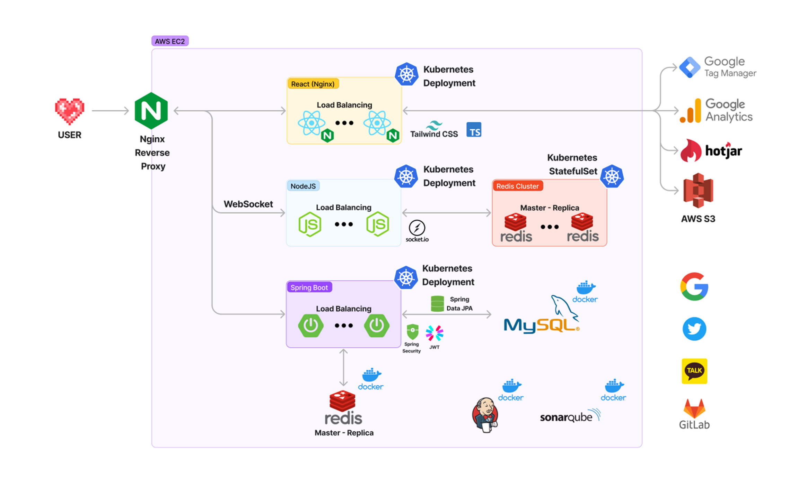

# 하팅!

## 프로젝트 개요

SSAFY 8기 2학기 자율 프로젝트

2023.04.10 ~ 2023.05.19

## 프로젝트 기획 의도

- 사랑을 가볍게, 자주 표현할 수 있는 서비스
- 마음 전달 프로젝트
- 익명의 메세지 서비스
- url 공유를 통한 프라이빗 메세지함 전달

## 프로젝트 목표

- 애자일한 개발
- 많은 사용자 받기
- 피드백 기반 개선

## 서비스명 & 로고


## 주요기능

- **메시지 보내기**
    - 하트판은 나만의 공간이자 URL을 통해 접속한 사람만이 볼 수 있는 공간으로 최근 받은 하트를 확인하고 메시지를 작성 ****할 수 있습니다.
    - 메시지 작성 시 기본 하트 5개가 주어지고 주고 받은 메시지 개수에 따라 풍부한 감정을 표현하는 스페셜 하트가 주어집니다.
- **받은 메시지**
    - 받은 메시지는 기본적으로 **24시간** 이후에 사라집니다.
    - 내가 받은 메시지에 대해 **반응**을 남길 수 있고 상대방이 확인할 수 있습니다.
- **영구 보관함**
    - 메시지가 사라지기 전에 저장한 경우 영구 보관함에 보관할 수 있습니다.
- **하트 도감**
    - 도감에서 내가 사용 가능한 **다양한 하트들과 획득 조건**을 확인할 수 있습니다.
- **실시간 알림**
    - 메시지 수신 시 및 새로운 스페셜 하트 획득 시 받을 수 있습니다.
- **하트테스트**
    - 자신의 심볼 하트를 확인할 수 있습니다.

## 서비스 화면


## **기술 차별점**

- **유저 경험 향상**
    - WebSocket 전용 서버 사용
        - 하트를 받은 유저의 메인 페이지에 실시간 알람을 구현함으로써 유저경험을 향상시켰습니다.
        - 웹소켓 실시간 통신의 원활한 구동을 위해 node.js로 별도의 웹소켓 백엔드 서버를 구현했습니다.
        - 특히 향후 사용자 피드백을 통한 추가 실시간 기능 추가 필요 시 메인 백엔드 서버의 부하를 덜 수 있습니다.
        - Kubernetes Deployment로 다수 node.js 서버를 운영하기 위해 redis cluster를 통해 각 node.js 서버 상태공유를 구현하였습니다.
- **대규모 트래픽 대응**
    - Kubernetes Cluster 사용
        - 대규모 트래픽 발생에 대비하여 백엔드 서버(Spring Boot, node.js)를 Kubernetes Deployment로 관리하여 다수의 백엔드 서버를 구동하고 요청에 대한 Load Balancing을 구현하였습니다. 이로써 각각의 서버에 대한 부담을 줄여 백엔드 안정성을 향상시킵니다.
        - Kubernetes를 활용함으로써 관리하는 서버의 항상성을 보장합니다. 몇 개의 서버가 다운되어도, 다른 서버가 살아있기 때문에 전체 서비스가 다운될 가능성을 줄이고, 다운된 서버를 쿠버네티스가 다시 구동시켜 안정적인 시스템 구축을 지원합니다.
        - Kubernetes를 활용하여 Rolling Update를 구현했습니다. Agile하게 개발하여 배포 횟수가 잦은 만큼 서비스에 지장 없이 신규 버전을 배포하는 것이 중요하다고 생각하였습니다.
        - 또한, 다수의 node.js 서버를 두어도 웹소켓 통신이 원활하게 하기 위해 Redis Cluster로 node.js 서버들의 상태관리를 할 계획입니다. 이 Redis Cluster는 Kubernetes StatefulSet로 관리합니다.
    - Redis 캐싱 및 Replication
        - redis는 인메모리 구조 데이터베이스로, redis 캐싱을 이용하면 MySQL 보다 빠르게 데이터에 접근할 수 있습니다.
        - redis Hash 자료구조를 사용하여 기존의 하트 획득 로직 성능을 O(M*N) 에서 O(1)로 최적화하였습니다.
        - read가 많은 데이터를 레디스에 저장하여 API 응답 속도를 최적화했습니다.
        - 장애를 대비하여 replication을 구축해 사용성을 높였습니다.
- 반응형 웹
    - 독자적 환산단위 적용한 반응형 웹 구현
    - 기기 상관 없는 안정적인 뷰 제공
- 데이터 기반 의사결정
    - 구글 애널리틱스, 핫자(hot jar)
    - 구글 태그 매니저를 활용하여 컴포넌트 단위로 이벤트 전환율 측정
    - KPI 달성 여부 확인
    - 아토믹 디자인, page단에서만의 api 통신으로 컴포넌트 간 의존성 낮춤
- 확장가능성
    - 자동 언어 번역
        - 유저풀 확장
    - 어플리케이션 출시
        - 장기 유저 유도

## 개발환경

### Frontend

- Node JS 18.13.0 (LTS)
- React 18.2.0
    - Recoil 0.7.7
- Typescript 4.9.5
- Axios 1.3.6
- Tailwind CSS 3.3.1

### Backend

- Java
    - Java OpenJDK 11
    - Spring Boot 2.7.10
        - Spring Data JPA 2.7.10
        - Spring Security 2.7.10
        - JUnit 5.8.2
        - Lombok 1.18.26
    - Gradle 7.6
- Node JS 18.13.0 (LTS)
- Socket IO 4.6.1\

### Server

- Ubuntu 20.04 LTS
- Nginx 1.18.0
- Docker 23.0.4
- Docker Compose 2.17.2
- MicroK8s (Kubernetes) 1.26.4
- Sonarqube 3.4.0
- Jenkins 2.387.3

### Database

- MySQL 8.0.30
- Redis 7.0.11

### UI / UX

- Figma 93.4.0

### IDE

- Visual Studio Code 1.78.2
- IntelliJ IDEA 2023.1

### 형상 / 이슈관리

- Gitlab
- Jira

### 웹사이트 분석/관리

- Google Analytics 4
- Google Tag Manager
- Hotjar

### 기타 툴

- Postman 10.14.2
- Termius 7.58.7

## 프로젝트 구조

### Frontend (React)

```yaml
Hearting
├── assets
│   └── images
│       ├── logo
│       ├── pixel
│       │   ├── button
│       │   ├── emoji
│       │   └── heart
│       ├── png
│       ├── sharing
│       └── social
├── atoms
├── components
│   ├── Home
│   ├── common
│   ├── heartBoard
│   ├── heartBox
│   ├── heartGuide
│   ├── heartResponse
│   ├── heartTest
│   ├── heartwrting
│   ├── manual
│   ├── modal
│   ├── navbar
│   ├── popUp
│   └── reporting
├── features
│   ├── api
│   └── hook
├── pages
├── styles
└── types
```

### Backend (Spring Boot)

```yaml
Hearting
├── api
│   ├── controller
│   ├── data
│   ├── request
│   ├── response
│   └── service
├── config
├── db
│   ├── domain
│   └── repository
├── exception
├── jwt
├── oauth
│   ├── domain
│   └── info
└── util
```

### Backend (NodeJS)

```yaml
Hearting
├── Dockerfile
├── app.js
├── config.env
├── package-lock.json
├── package.json
├── public
│   ├── index.html
│   └── script.js
└── server.js
```

## 서비스 아키텍쳐



## 협업 환경

### Git으로 협업하기

Git을 통한 협업 방식은 [우아한 형제들 Git Flow](https://techblog.woowahan.com/2553/)를 기본 베이스로 삼았습니다.

브랜치는 master, develop, dev-front, dev-back, feature 총 5가지를 사용했으며 전략은 다음과 같습니다.

- `master`: 서비스가 출시될 수 있는 브랜치입니다. master 브랜치에 올라온 기능들은 에러 없이 작동하는 상태입니다.

- `develop`: 다음 서비스 출시를 위해 실제 개발이 이루어지는 브랜치입니다.

- `dev-front`, `dev-back`: develop 브랜치에서 분기해서 프론트엔드와 백엔드가 각각 개발하는 브랜치입니다. 프론트엔드와 백엔드 충돌을 최대한 방지하기 위해 만들어졌습니다.

- `feature`: 기능 단위 개발을 위한 브랜치로 dev-front, dev-back에서 분기하여 개발이 끝나면 각각 베이스 브랜치로 병합됩니다.

매주 한 번 이상 dev-front, dev-back 브랜치를 develop 브랜치로 병합 후 배포하여 실제 배포 환경에서 잘 동작하는지 여부를 확인했습니다.

### Jira로 협업하기

매주 월요일 스프린트 회의를 통해 그 주의 목표를 세우고 목표 달성을 위한 구체적인 작업들을 정리했습니다.

유튜브 라이브와 같이 공통적인 일정부터 팀 회의, 파트별 회의, 개인 개발 작업까지 회의를 통해 구체적으로 계획했습니다.

이를 위해 사용된 요소들은 다음과 같습니다.

`에픽`: 어떤 작업이 속하는 최상위 레벨로 학습, 설계, 회의, 개발, 공통 총 5가지 에픽을 만들었습니다.

`스토리`: 에픽에 속하는 작업의 단위입니다. 구체적인 작업 내용을 작성하고 스토리 포인트로 예상 소요 시간을 산정할 수 있습니다. 한 스토리 당 최대 4시간을 넘지 않게 하였고 개인별로 매주 40시간 이상 할당했습니다.

`번다운 차트`: 스프린트의 목표를 달성하기 위해 남은 시간과 남은 스토리 포인트를 확인해 프로젝트의 진척도를 파악할 수 있는 지표입니다.

### Notion으로 협업하기

회의록, 스크럼 회의, 발표 정리, 문서 정리, 기획서 등 자료들을 Notion을 통해 작성 및 관리하였습니다.

- `회의록`: 매일 회의한 내용을 회의록으로 기록하였습니다.
- `프로젝트 일지`: 개인별로 프로젝트 일지(problem-cause-solution)를 작성하였습니다. 프로젝트 일지는 개발하면서 만난 오류와 문제 상황을 정리하고 원인과 해결방법을 적습니다.
- `컨벤션`: 프로젝트의 모든 컨벤션들을 문서화하여 모두가 공유 가능하도록 하였습니다. 기록 및 정리한 컨벤션들에는 Git 컨벤션, Jira 컨벤션, FE 컨벤션, BE 컨벤션이 있습니다.
- `프로젝트 문서 관리`: 요구사항 정의서, 기능명세서, 일정관리 등 공유 문서 관리를 노션에 기록하여 모두가 동일한 목표를 가지고 개발 할 수 있도록 하였습니다.

## 팀원

- FrontEnd
    - 권오연
    - 서현경
    - 이가은

- BackEnd
    - 손민혁
    - 임영묵
    - 황정주

- Infra
    - 임영묵
